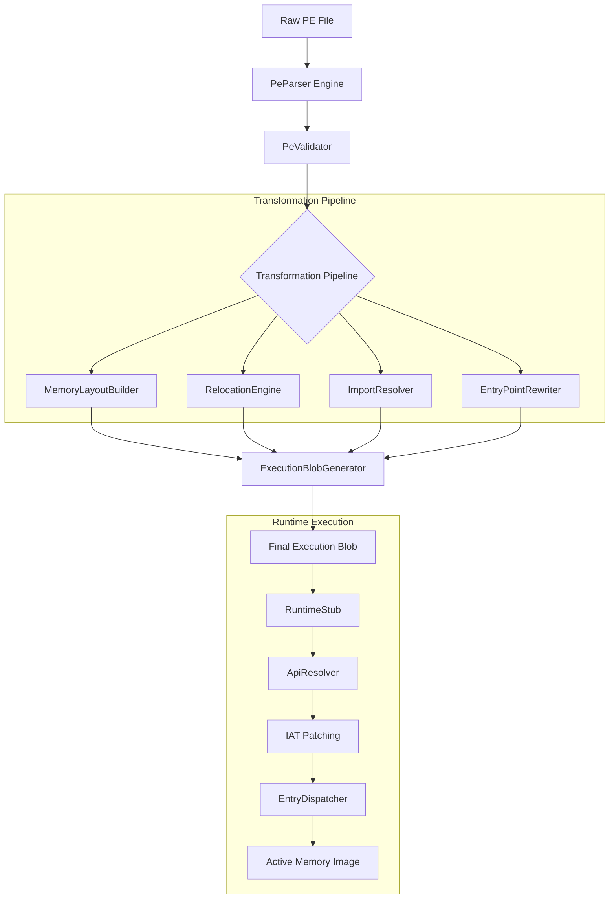

# Exe2Mem: Memory-Native PE Transformation Framework


[](https://en.cppreference.com/w/cpp/23)
[](https://opensource.org/licenses/MIT)

**Exe2Mem** is a next-generation C++23 framework designed for transforming standard Windows Portable Executable (PE) files into memory-native executable blobs. It provides a robust pipeline for decoupling executables from the disk, enabling direct memory execution through advanced transformation and loader engineering.

---

## 🚀 Key Features

### 🔍 Core PE Analysis

- **Dual Architecture Support**: Seamlessly parses both x86 and x64 Windows binaries.
- **Deep Structure Validation**: Security-focused validation against section overlaps, malformed headers, and OOB data.
- **Rich Metadata Extraction**: Automated parsing of Imports (ILT/IAT), Relocations, and TLS Callbacks.

### 🛠️ Transformation Pipeline

- **Memory Image Synthesis**: Reconstructs the PE layout into a functional memory-mapped state.
- **Intelligent Relocation**: Advanced engine supporting `DIR64`, `HIGHLOW`, `HIGH`, and `LOW` base relocation types.
- **Metadata Serialization**: Structured serialization of import requirements for the runtime loader.
- **Entry Point Virtualization**: CLI-driven redirection of image entry points.

### ⚡ Runtime Loader Stub

- **Custom API Resolution**: Modular `GetProcAddress` and `GetModuleHandle` abstractions for stealth.
- **On-the-fly IAT Patching**: Dynamic Import Address Table resolution at execution time.
- **Environment Orchestration**: Handles TLS initialization and secure entry point dispatching.

---

## 🏗️ Architecture Overview

The following diagram illustrates the data flow from a raw PE file to a memory-native execution blob.



---

## 🛠️ Getting Started

### Prerequisites

- **Compiler**: C++23 compatible compiler (Visual Studio 2022, Clang 17+, or GCC 13+)
- **Build System**: CMake 3.20 or later

### Installation & Build

```bash
# Clone the repository
git clone https://github.com/ismailtsdln/Exe2Mem.git
cd Exe2Mem

# Create build directory
mkdir build && cd build

# Configure and build
cmake ..
cmake --build . --config Release
```

---

## 📖 Usage

The **Exe2Mem CLI** is the primary interface for transforming binaries.

### Basic Transformation

Transform a standard EXE into a memory blob:

```bash
./exe2mem_cli target.exe output.bin
```

### Custom Entry Point

Redirect the image entry point to a specific RVA:

```bash
./exe2mem_cli target.exe output.bin --entry 0x1234
```

---

## 📂 Project Structure

| Directory | Description |
| :--- | :--- |
| `core/` | Core PE analysis engine and validation logic. |
| `transform/` | Transformation pipeline and blob generation. |
| `loader/` | Runtime loader stubs and API resolution. |
| `cli/` | Command-line interface implementation. |
| `tests/` | Comprehensive unit and E2E verification tests. |

---

## 🛡️ Security & Ethical Disclaimer

> [!WARNING]
> **Exe2Mem** is intended for **authorized security research, red team simulations, and educational purposes only**. Using this tool against targets without prior explicit authorization is illegal and unethical. The authors assume no liability for misuse of this project.

---

## 📄 License

Distributed under the MIT License. See `LICENSE` for more information.

---

<p align="center">
  Developed with ❤️ by <b>Ismail Tasdelen</b>
</p>
